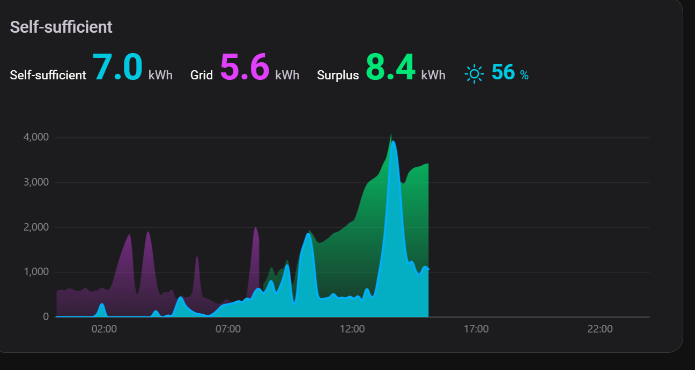
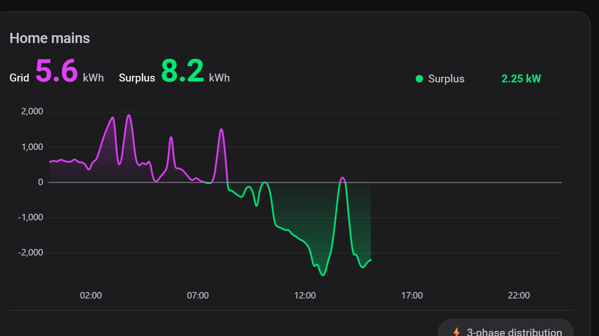
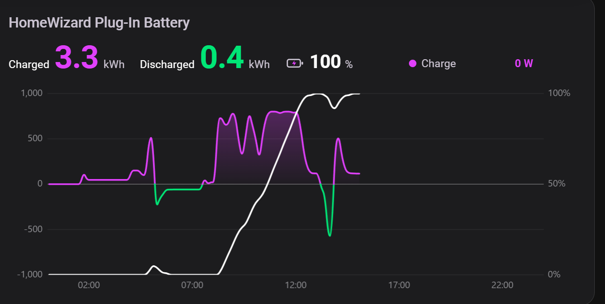
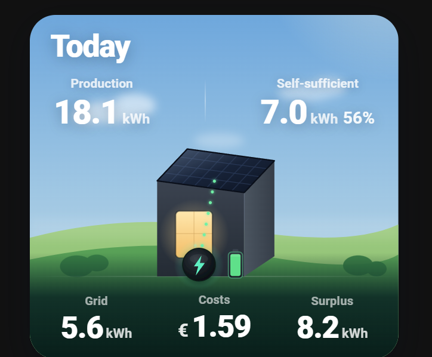

# HomeWizard-style energy cards for Home Assistant

A set of custom Lovelace cards that recreate the look and feel of the **HomeWizard Energy** mobile app inside Home Assistant — one dark, rounded *single pane of glass* for grid, solar, battery, consumption and self-sufficiency, with a live **Now** view plus **Day / Week / Month / Year** history.

Everything is plain canvas-drawn web components (no external chart library), themed to match each other, and driven by a shared period/date picker.

> ⚠️ **Not affiliated with, or endorsed by, HomeWizard.** "HomeWizard" is a trademark of its respective owner. These cards merely *emulate the visual style* of the HomeWizard Energy app. They work with data from HomeWizard P1 Meter / Plug-In Battery devices as well as Growatt and SMA inverters — but any equivalent sensors work, the entity IDs are configurable.

---

## Screenshots

_Screenshots of each card on a live dashboard will go here._

<!-- Place PNGs in screenshots/ and reference them, e.g.:




-->

---

## Cards

| File | Card (`type:`) | What it shows |
|------|----------------|---------------|
| `dist/home-mains-card.js` | `custom:home-mains-card` | Grid mains — live **Now** + **Day** power, **Week/Month/Year** energy bars; import magenta / export green, dynamic axis, optional 3-phase distribution toggle. |
| `dist/phase-mains-card.js` | `custom:phase-mains-card` | Per-phase grid power (L1/L2/L3); export drawn below zero (green); follows the energy date picker. |
| `dist/self-sufficient-card.js` | `custom:self-sufficient-card` | Self-sufficiency — consumption vs production with the overlap (self-sufficient) filled cyan, grid import magenta, surplus green, plus a self-sufficiency **%**. |
| `dist/battery-card.js` | `custom:battery-card` | Plug-in battery — charge/discharge power area + charge-% line (**Now/Day**); grouped charged/discharged energy bars (**Week/Month/Year**). |
| `dist/production-card.js` | `custom:production-card` | Solar production (single green series) — live **Now** + **Day** + **Week/Month/Year** bars. Parameterizable for **Total** or **per-inverter** (e.g. Growatt, SMA). |
| `dist/homewizard-today-card.js` | `custom:homewizard-today-card` | A scenic **Today** overview (production, self-sufficient, grid, cost, surplus) with animated energy flows. |
| `dist/usage-card.js` | `custom:usage-card` | Household consumption with a battery-charging breakdown (magenta total, purple battery portion within). |
| `dist/energy-header-card.js` | `custom:energy-header-card` | The fixed **date picker + period tabs** (Now / Day / Week / Month / Year) that all the other cards follow. |

---

## Data model

The cards share one consistent energy model:

- **consumption** = `solar + grid − battery` — gross household load, *excluding* battery charging.
- **self-sufficient** = `min(consumption, production)` = consumption met without the grid = `consumption − grid import`.
- **grid** = grid **import** (magenta), **surplus** = grid **export** (green) — taken from the real P1 meter, so they match the mains card exactly.

This keeps every card internally consistent: Growatt + SMA production = Total production, and self-sufficient + grid = consumption.

---

## Installation

### Option A — HACS (recommended)

1. **HACS → ⋮ → Custom repositories** → add `https://github.com/abiskaev/ha-homewizard-energy-cards` with category **Dashboard**.
2. Install **HomeWizard-style Energy Cards**. HACS downloads all the cards to `/hacsfiles/ha-homewizard-energy-cards/` and auto-registers the main one (`home-mains-card.js`) as a dashboard resource.
3. For each **additional** card you want, add a resource (Settings → Dashboards → ⋮ → Resources), type **JavaScript Module**:
   ```
   /hacsfiles/ha-homewizard-energy-cards/self-sufficient-card.js
   ```
   …one line per card.

### Option B — Manual

1. Copy the `dist/*.js` you want into your Home Assistant `config/www/` folder.
2. Register each as a dashboard **resource** (a `?v=` query is handy for cache-busting on updates):
   ```yaml
   - url: /local/self-sufficient-card.js?v=1
     type: module
   ```

### Then

Add the card to a dashboard:
```yaml
type: custom:self-sufficient-card
```
These render best in a **sections** (grid) dashboard with a dark theme.

---

## The shared period / date picker

Every card follows two helpers so they all change period and date together. Create them once:

```yaml
input_select:
  energy_period:
    name: Energy period
    options: [Now, Day, Week, Month, Year]
    initial: Day

input_datetime:
  energy_date:
    name: Energy date
    has_date: true
    has_time: false
```

Drop in the **`energy-header-card`** to drive them (tabs + a calendar). Override per card with `period_entity:` / `date_entity:` if your helpers are named differently.

---

## History backend — Day / Week / Month / Year

The past-day graphs and the Week/Month/Year bars read a tiny JSON archive produced by **`archiver/energy_archive.py`**. It runs *inside* the HA container, reads the recorder database **read-only**, and writes per-day 5-minute averages + daily import/export/self-sufficiency totals to `config/www/energy-archive/`. No cloud, no extra database — it travels with your config.

**Set it up:**

1. Copy `archiver/energy_archive.py` to your `config/` folder.
2. Edit the entity IDs near the top (`ENTITIES`, `IMP_REG`, `PROD_REGS`, …) to match your sensors.
3. Run it daily and on startup. Example using a shell command + automation (HA in Docker):

   ```yaml
   # configuration.yaml
   shell_command:
     energy_archive: docker exec homeassistant python3 /config/energy_archive.py
   ```

   ```yaml
   # automation
   - alias: Energy archive
     trigger:
       - platform: time
         at: "00:10:00"
       - platform: homeassistant
         event: start
     action:
       - service: shell_command.energy_archive
   ```

   (If HA isn't in Docker, run `python3 /config/energy_archive.py` however suits your install.)

The script self-heals: with no argument it re-archives a sliding window of recent days, so a missed run catches up. Daily self-sufficiency totals are retained long-term, so the Week/Month/Year bars fill out over time.

---

## Configuration

Each card takes its entities through card config. **The built-in defaults reflect the author's own setup** (HomeWizard P1 + Plug-In Battery, Growatt + SMA solar) — override them with your own entity IDs. The full list of keys is at the top of each `.js` (in `setConfig`). Common keys across cards:

| Key | Default | Meaning |
|-----|---------|---------|
| `title` | per card | Header title |
| `height` | ~250 | Chart height in px |
| `bucket_minutes` | ~10 | Day-graph averaging bucket |
| `period_entity` | `input_select.energy_period` | The period picker |
| `date_entity` | `input_datetime.energy_date` | The date picker |

**Examples:**

```yaml
type: custom:home-mains-card
power_entity: sensor.p1_meter_power            # signed W: + import / - export
phases:
  - { entity: sensor.p1_meter_power_phase_1, name: Phase 1 }
  - { entity: sensor.p1_meter_power_phase_2, name: Phase 2 }
  - { entity: sensor.p1_meter_power_phase_3, name: Phase 3 }
```

```yaml
type: custom:self-sufficient-card
cons_entity: sensor.home_consumption_power
grid_entity: sensor.p1_meter_power
summary_url: /local/energy-archive/selfsuff_daily.json
```

```yaml
type: custom:battery-card
power_entity: sensor.plug_in_battery_power     # + charging / - discharging
soc_entity: sensor.plug_in_battery_state_of_charge
```

```yaml
type: custom:production-card
title: SMA production
power_entity: sensor.sma_pv_power
today: sensor.sma_production_today
```

---

## Sensors these cards expect

You'll need equivalents of (override the IDs as needed):

- **Grid:** `sensor.p1_meter_power` (signed W), `…_phase_1/2/3`, cumulative `…_energy_import` / `…_energy_export`.
- **Solar:** a total production power sensor (and optional per-inverter ones) + cumulative yield counters.
- **Battery:** `…_power` (+charge / −discharge), `…_state_of_charge`, cumulative `…_energy_import` / `…_energy_export`.
- **Consumption:** a `home_consumption_power` template ≈ `solar + grid − battery` (gross load, excluding battery charging), plus daily totals (`home_consumption_today`, `grid_import_daily`, `grid_export_daily`).

---

## License

[MIT](LICENSE).

## Credits

Built for Home Assistant. Visual style inspired by the HomeWizard Energy app (with which this project is not affiliated).
